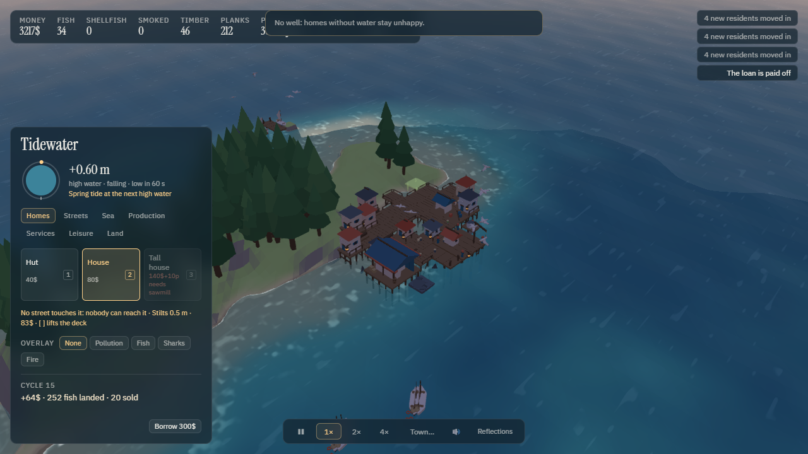

# Tidewater

A coastal town simulator where the tide is the clock. Twice a cycle the water rises over the flats and the boats
go out; twice it drains and the flats become the workplace. You place, the town runs itself. The sea gives (fish,
shellfish, trade, tourists) and the sea takes (pollution, sharks, storms, and once in a long while a wave).



## Run it

```bash
npm install
npm run dev
```

Open http://localhost:5180. `npm run build` typechecks and bundles to `dist/`; `npm run preview` serves that.
`npm run test` runs the simulation's unit checks; `npm run smoke` drives the whole game headlessly through every
milestone and drops screenshots in `shots/`.

## Controls

| Do | How |
| --- | --- |
| Pan | drag the ground (left or middle button), W A S D or the arrow keys |
| Rotate / tilt | right-drag; Q / E turn |
| Zoom | scroll toward the cursor; R / F. The view tilts down as you zoom out |
| Home | the Home key frames the town |
| Pick a building | the tabs in the panel (Tab cycles them), or the number keys shown on the buttons |
| Place | click a cell — the ghost is green when it fits, amber if spring tides will flood it, red if every high tide will, grey when it can't go there (the line under the palette says why) |
| Lay a run | with a walkway, path, raised walkway, breakwater, net or sea wall selected, drag and the run follows your pointer; the hint prices it |
| Land | the Land tab: landfill raises a flat cell to dry ground (45$ + 4 timber), plant and clear trees on the hill |
| Borrow | **Borrow 300$** under the ledger: 360$ back at 24$ a tide over 15 tides, one loan at a time |
| Deck height | every walkway and building sizes its own stilts to clear the tide; the ghost shows the stilt length and price (low ground costs more). `]` lifts a deck higher (never lower), `[` brings it back down — lift above the wave line to ride out a tsunami |
| Inspect | click any building; Esc closes the panel |
| Remove | right-click — half the money comes back |
| First pier | the gold ring on the water shows where it fits; docks need a pier or raised walkway alongside |
| Buy a boat | pick **Boat** (Sea tab) and click a pier or dock |
| Lantern post | pick **Lantern post** (Streets tab) and click a walkway |
| Order planks | the button in the panel once you have a harbor; the trade ship brings them |
| Overlays | Pollution, Fish, Sharks, Fire — the buttons above the ledger line |
| Speed | the bar at the bottom: pause (space), 1×, 2×, 4× |
| Save / load / new town | **Town…** at the bottom, or Esc. **New town** starts on the island of the seed in the field (0 is the original island; **Random** picks another) |
| Sound | the speaker button; it starts on your first click |
| Reflections | **Reflections** at the bottom — a second render of the scene in the water; off by default |

## How the town works

- **Walkways** connect everything to a pier. Every piece stands on stilts sized to clear the tide, so nothing
  floods at an ordinary high water; only a walkway on the lowest flats goes under at a spring tide, and the
  amber ghost tells you so — a raised walkway there stays dry. Long stilts cost more. A new walkway rises to
  meet the deck beside it, so streets run level. **Paths** carry the street onto the dry hill.
- **Boats** sail from piers at high water and from deep docks on every tide, to the richest ground in range, and
  thin it. Oyster beds and clam camps work the exposed flats at low water. Every fourth tide is a spring tide.
- **People** move in while there is food, work and room; they walk to work at shift change, level their homes when
  life is good (food, work, water, leisure, lanterns, clean water), and swim at the beach on sunny high waters.
- **The ledger settles at every high-tide peak**: the market sells beyond the food reserve, taxes and upkeep are
  paid, wood becomes planks, the shipyard builds, the trade ship calls, fires start where smokehouses cluster.
- **What the sea does back**: an outfall's waste drifts with the tide and kills oyster beds; fish waste draws
  sharks to busy beaches; storms keep boats in and take the unsheltered ones; after cycle 20 the sea may pull back
  and return as a wave that damages everything low and unshielded. Breakwaters shelter harbours; sea walls shield
  the flats behind them; a lighthouse sees every boat home.
- **A day is two tides.** The sun rises with the first, stands at noon a quarter-day in, sets at the second,
  and the moon and stars take over; lanterns light at dusk. Boats trail their nets while they fish, porters
  carry the catch from the pier to the market when the boats land, and a shipyard hammers while it builds.
- **Districts** are clusters of three or more touching buildings; click anything to see its district's name and
  numbers. **The isle** off the south-east is locked until you build a harbor — then the ferry runs and it takes a
  pier and a town of its own. Milestones (first boat, fifty residents, first trade…) pop up as you reach them.

## Layout

`src/sim` is the ledger: every number, ticking on a fixed timestep, importing nothing from Babylon. `src/view`
draws it and never writes to it. `src/ui` is the DOM. `shaders/` is the water and sky study, byte for byte, plus a
handful of uniforms. `test/` holds the sim checks, the shared scripted-town scenarios, and the headless smoke.
`NOTES.md` records every decision the brief didn't make; `HANDOFF.md` is where things stand.
