# Assets pilot — should headless Blender be a second way to make a mesh?

Branch `assets-pilot` (from main at 962622d). The brief: build the pipeline, make six assets that correspond to kits
the game already draws from primitives, put them side by side, measure, recommend. Nothing the game ships changed:
the Blender versions sit behind `USE_BLENDER_ASSETS = false` (config.ts) and a console comparison, and CLAUDE.md is
untouched. PROGRESS.md is the ledger, decisions.md the calls the brief left open.

## Recommendation

**Yes, sanction it, but narrowly.** Headless Blender should become the second way to make a mesh for one class of
thing: **fixed-shape props and creatures that the game thin-instances** (boats, fauna, trees, later the trade ship
and the ferry), whose silhouettes come from curves, lofts and bevels. Everything the ledger shapes at runtime stays
procedural in TypeScript.

The boundary, and why:

- **Procedural (TypeScript), always**: buildings (levels, turns, damage lean, stilts sized to the ground under them,
  lantern positions), streets (joins, rails, stairs to a neighbour's height), roofs by shape, terrain, water, the
  World's miniatures, effects. Their geometry is a function of sim state and the grid at the moment they're drawn;
  an offline file can't know it.
- **Blender-built, where it earns it**: a shape that never changes with state and is drawn many times from one
  template. The pilot's six are all of this kind, and the pipeline made their shapes cheap: a planked hull with a
  sheer line, a crab-claw sail, curled stem posts, a bevelled shell, drooping folded fronds.
- **Not by default for anything that looks the same at the game's camera.** At the island's default distance (30)
  a boat is about 40 pixels long, and the primitive and Blender versions are close to indistinguishable (the
  comparisons below). The detail pays close up: after a dive (radius 22 settling to 30) and when the player zooms in
  toward 8. A new kit should go through Blender when it will be seen close, or when its shape is a curve the
  primitive builders can only approximate; otherwise a primitive kit is fine.

**Before flipping the flag**, three conditions, in this order. A person looks at the comparison shots and agrees
the Blender versions are better up close and no worse at 30. CLAUDE.md §2 is amended, because it currently says
"no imported models": the amendment would name this class and this pipeline, and keep the palette-and-budget
contract. And the longboat is trimmed: it triples the primitive's triangles (844 against 280) for detail (shields,
oars, curled posts) that only a close camera sees.

## The pipeline

`npm run assets` (optionally with asset names and `--look <id>`):

1. **palette.ts** reads the looks from src/view/biomes (bundled with esbuild, refused if it would pull Babylon) and
   writes tools/assets/palette.json: every hex per look by role (water, terrain, walls, roofs, accents, trees,
   walkers, sky), plus the set a kit may paint with. The run fails if the file changed and wasn't committed, so a
   look edit can't silently leave the assets behind.
2. **Blender** is resolved once (BLENDER_PATH, PATH, then the usual install folders; 4.x or later) and remembered in
   tools/assets/blender.json (gitignored). This machine has 5.2.2 LTS (decision #1).
3. **build.py** runs headless (`blender -b --factory-startup -P tools/assets/build.py -- …`). Each asset is a kit,
   tools/assets/kits/<name>.py, exposing `build(bpy, palette, look_id)`. lib.py gives them plain-geometry helpers
   (box, loft, blob, slab, spar, sheet) and turns the result into Blender objects: every face flat-shaded, one CORNER
   colour attribute named COLOR_0 painted only from the look's palette (three tint masks aside, for parts the game
   paints per instance), welded, triangulated, normals outward, origin at the base centre, one named child per part.
   Then the triangle budget is enforced (props 600, boats 900; it caught the longboat at 916), the GLB is exported
   (+Y up, vertex colours, one material), and a turntable is rendered.
4. The outputs are committed (public/assets/*.glb, shots/assets/*.png), so CI and other machines never need Blender.

A full build of all twelve files takes about 11 s. One asset takes about 5 s, most of it Blender starting up.

## The six assets

Each turntable is one orthographic Workbench render: front (bow toward the camera) top left, three-quarter top
right, side (bow to the right) bottom left, top bottom right, and a one-cell cube underneath for scale. The
background is the look's sky colour. Tint-masked parts are shown in the game's colour.

| Asset | Kit it replaces | Look | Triangles, Blender / primitive | GLB | Named parts |
|---|---|---|---|---|---|
| dory | BoatKit "dory" | Tidewater | 280 / 308 | 26.1 KB | hull, trim, mast, sail |
| outrigger | BoatKit "outrigger" | Atoll | 388 / 192 | 32.9 KB | hull, trim, float, mast, sail |
| longboat | BoatKit "longboat" | Fjord | 844 / 280 | 63.1 KB | hull, trim, mast, sail |
| whale | FaunaKind "whales" | Fjord | 306 / 228 | 28.9 KB | back, spout |
| turtle | FaunaKind "turtles" | Atoll | 264 / 292 | 25.3 KB | shell, head, flipper_fl, flipper_fr, flipper_bl, flipper_br |
| palm | TreeKit "palm" | Atoll | 508 / 236 | 57.3 KB | trunk, coconuts, frond_0 … frond_7 |

Twelve files in all, 508 KB: each boat is also built in the other two looks. Its colours are roles over the
palette (decision #4), so the same script with another look's palette is the whole recolour.

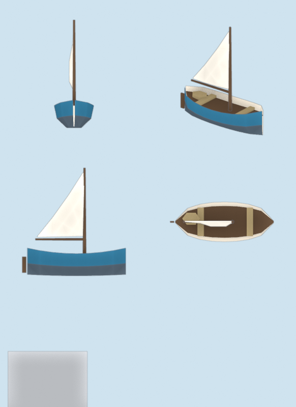 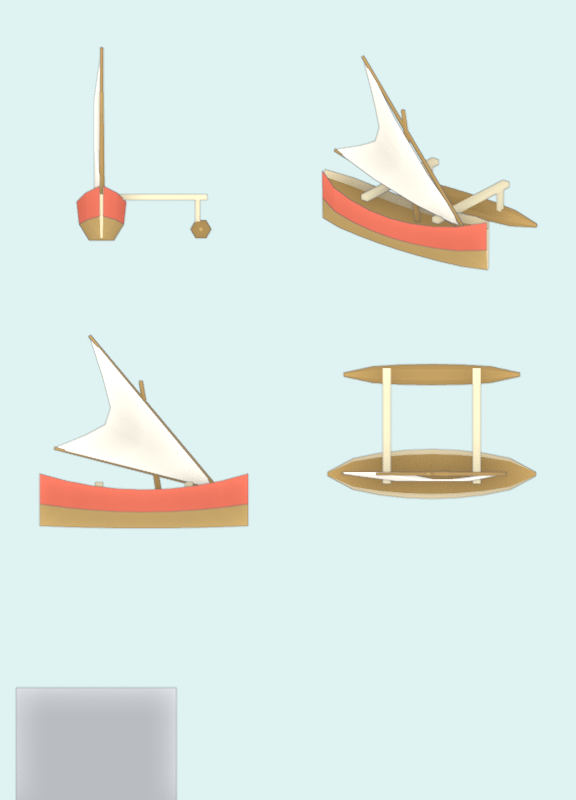 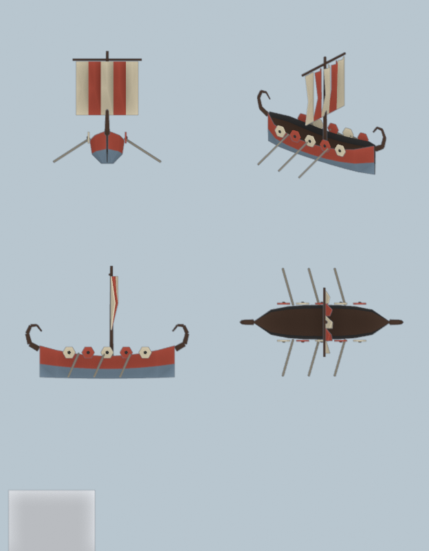
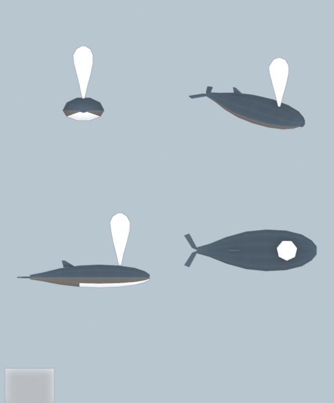 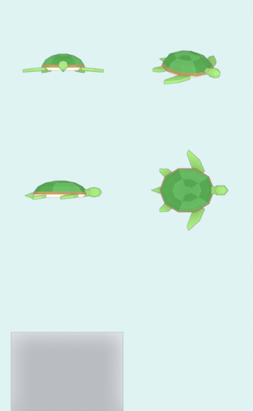 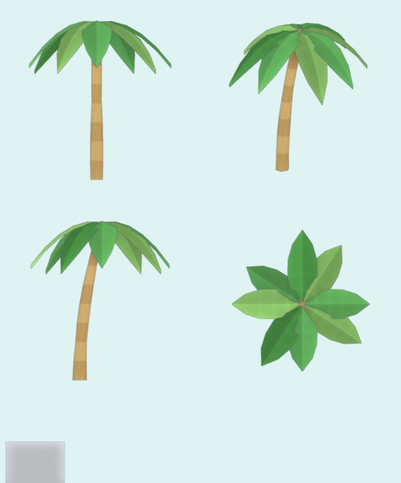

The recolours, data only: 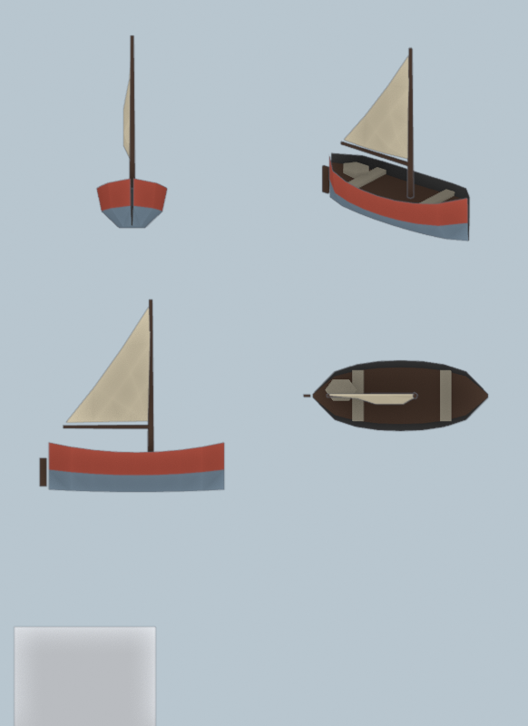 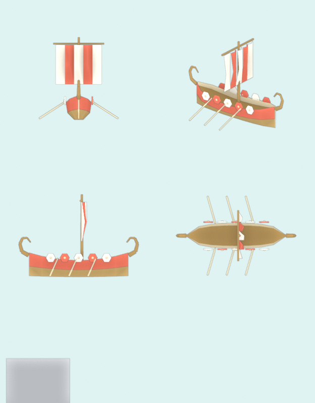

Fixed after looking, in the scripts, not the outputs: the whale's spout began as a stack of hexagonal blobs that
read like a totem and is now one plume. The palm's coconuts sat inside the crown's knot; they now hang below it,
and are still hidden by the fronds from every angle the game uses (kept, and noted as the kind of detail a camera
never sees).

## Side by side in the game

`__tidewater.view.assetCompare(name, look?)` puts the Blender asset beside its primitive kit on the island, near
the camera's target: boats, the whale and the turtle on open water, the palm on dry ground clear of trees. Both are
thin-instanced and painted the way their kits are. The smoke shoots every pair at noon and at dusk at the island's
default distance, plus a close look at noon (primitive left, Blender right):

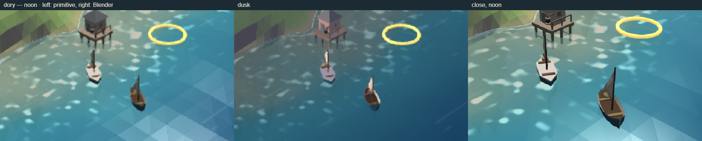
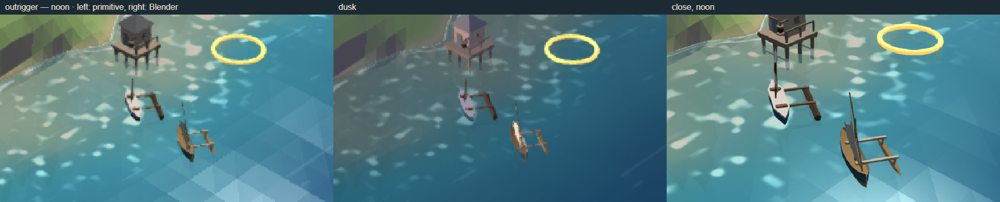
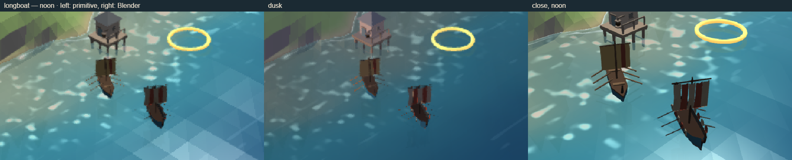
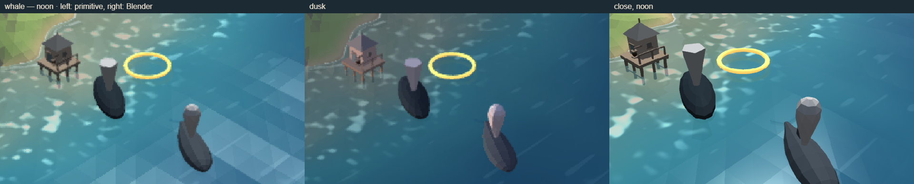
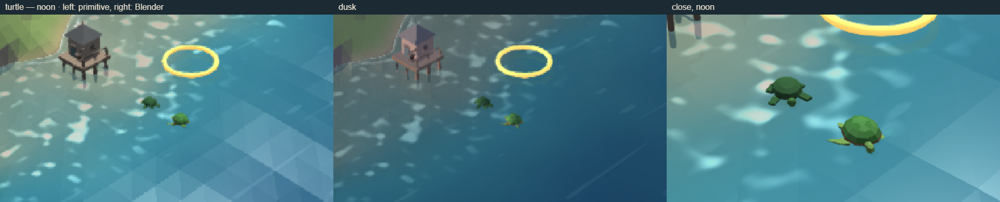
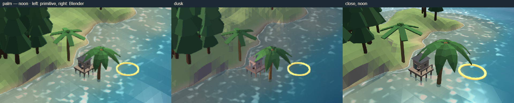

What they show:

- **At the default distance** the pairs read the same: a pale boat with a sail, a dark back with a plume, a green
  turtle. The Blender boats are darker because their upper strakes take the hull colour, where the primitive's
  broad pale gunwale covers most of its hull from above.
- **Close up** the Blender versions are plainly better: the dory's planked hull and bellied sail, the outrigger's
  crab claw, the longboat's shields and curled posts, the turtle's scutes and swept flippers, the palm's curve and
  folded fronds. The primitive palm's six flat boards are the weakest of the old kits and the clearest win.

## Measured

The 300-building towns with 30 boats each (test/quality.ts `--assets`), High preset, the Fjord in whale season.
The flag's on and off states were measured on the same page and storage (`?assets=blender` on the second pass).

| Coast | fps off / on, RTX 4060 | Triangles drawn off / on | Where the difference comes from | fps off / on, SwiftShader |
|---|---|---|---|---|
| Tidewater | 165.1 / 165.1 | 234 k / 253 k | 30 dories × (280 − 308) = −0.8 k; the rest is sampling noise (the software run measured 254 k / 253 k) | 8.1 / 5.1 |
| Fjord | 165.0 / 165.0 | 236 k / 253 k | 30 longboats × +564 = +16.9 k | 7.7 / 4.9 |
| Atoll | 165.1 / 165.1 | 261 k / 288 k | 30 outriggers × +196 = +5.9 k; about 70 palms × +272 = +19 k | 5.3 / 5.2 |

- **Frame rate**: no difference on the GPU (both at the display's 165 fps cap). On the software renderer
  (SwiftShader, the worst-case proxy) both land between 5 and 8 fps. The same "off" configuration measured
  5.2 / 5.1 / 5.3 and 8.1 / 7.7 / 5.3 in two runs, so the on/off gap is inside that renderer's run-to-run spread.
- **Triangles**: up 7 % on the Fjord and 10 % on the Atoll, all of it the longboat and the palm.
- **Loading**: with the flag on, the twelve files load in parallel at boot and the kits swap. All twelve are in
  350–400 ms after the first request on the GPU machine (including the glTF plugin's import), and 750–1,080 ms on
  the software renderer. Loaded one at a time after the plugin (the smoke's comparisons), each takes 5–21 ms.
  Every file arrived flat-shaded.
- **Bundle**: the main bundle grows by 44 KB (0.8 %; the loader glue and the core's scene loader). The glTF plugin
  is a separate 253 KB chunk, fetched only when the flag is on.
- **Repository**: 508 KB of GLBs and about 5 MB of turntable PNGs.

## What the pipeline made easy

- **The palette contract.** Every colour is a palette hex by construction, checked at build time. A recolour is a
  different look passed to the same script, and the three boats × three looks prove it.
- **Budgets and review.** The triangle budget is a hard stop (it caught the longboat), and every asset gets a
  deterministic four-view turntable in about a second, without running the game. Two of six assets were fixed
  because of what the turntables showed.
- **Shapes the primitive builders can only approximate.** Lofts along curves (hulls, the palm trunk, the whale),
  bellied sails and folded fronds were a few lines each. bmesh did the welding, triangulation and outward normals.
- **The game didn't have to change.** The kits ask for the same two meshes they always built, and thin-instance
  them unchanged. The loader's work is done once per file.

## What it made hard

- **Handedness, winding and colour space.** Blender is right-handed and Z-up, glTF right-handed and Y-up, Babylon
  left-handed and Y-up. glTF stores vertex colours linear, while the flat material wants sRGB bytes. The loader
  solves all three once (decision #14), but each was a place for a silent inside-out or darkened model.
- **The kit contracts leak into the asset.** Instance-painted parts must be exported in tint masks rather than
  palette colours. The coconuts had to ride with the trunk so the leaf colour wouldn't turn them olive. Each asset
  needed a fit offset to sit where its primitive sits: the keel under the origin, the whale's centre, the spout
  re-based to its own foot.
- **"Headless" means code, not hand modelling.** The kits are Python arithmetic, much like the TypeScript
  builders. What Blender adds is bmesh, the exporter and the renderer. An artist modelling by hand in a .blend
  file is where it would pay off more; the pipeline could take such a file as a kit later, but this pilot didn't
  try it.
- **Workbench's flat lighting hides the facets**, so the turntables add cavity shading and an outline to keep
  planes and silhouettes readable.
- **A second toolchain.** Blender (about 1 GB) is needed to rebuild, and a second language sits beside TypeScript.
  The runtime gains a dependency and an asynchronous load-then-swap path the primitive kits never needed.
- **Version drift.** The brief asked for Blender 4.x and the machine has 5.2.2 LTS. Nothing in the pipeline broke,
  but the exporter's options moved between versions, and a pinned version would be wise if this is adopted.
